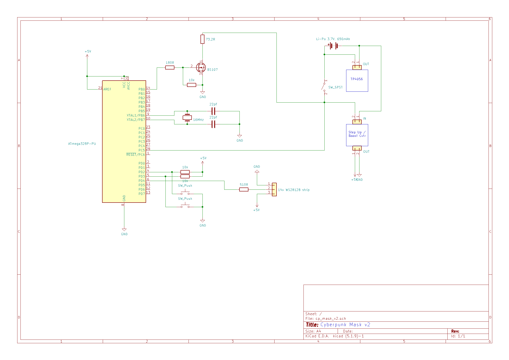

# Cyberpunk_Mask
In Times of SARS-CoV-2 you will need a fancy mask for your runs in Night City!
And here is version 2!

## Introduction
I'm V, a Cyberpunk, and I have the only possible solution for a corona mask: a fancy cyberpunk mask!

Version 2 is compact, with LiPo, charger and measures the LiPo charging level at start up. (green=good, yellow=you should charge, red=you must charge)

## Material

- 1S 3,7V 650mAh LiPo
- ATMEGA 328P-PU
- 2 22pF Cap
- 16MHz crystal
- switch for switching the mask on and off
- 2 push buttons for right and left blinking effect
- Step Up / Boost Converter for generating 5V from 3,7V
- TP4056 LiPo charging module (change resistor on pin 2 to 2k for correct charging current)
- some wires
- 3 10k pull-up resistors
- 510 ohms resistor
- 73,2 ohm resistor
- 180 ohm resistor
- BS107 or another logic level n-channel mosfet
- WS2812B LED strip (I used two 7LED strips in serial connection)
- mask (I bought black masks on ebay)
- hook-and-loop-tape (for taking off the led stripes and electronics, if you have to wash your mask)
- washable fabric glue for glueing the tape on the mask
- programmer for the atmega (burn arduino bootloader and upload program)

## Software

- Arduino IDE
- Adafruit NeoPixel library

## Schematic

## Images

